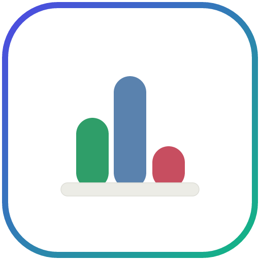
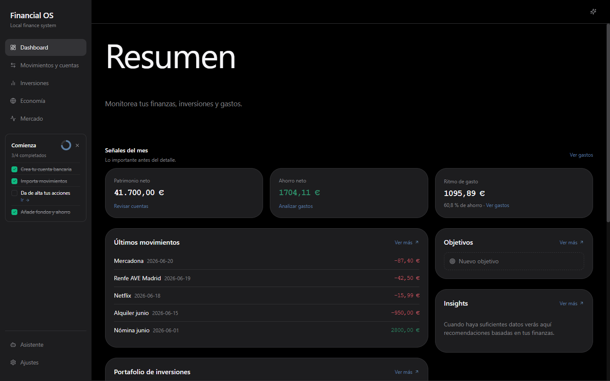
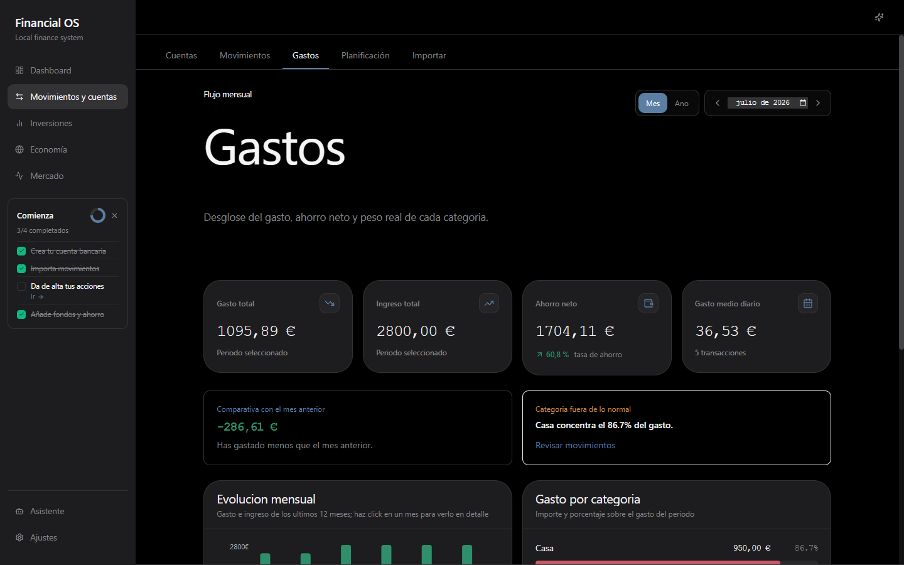
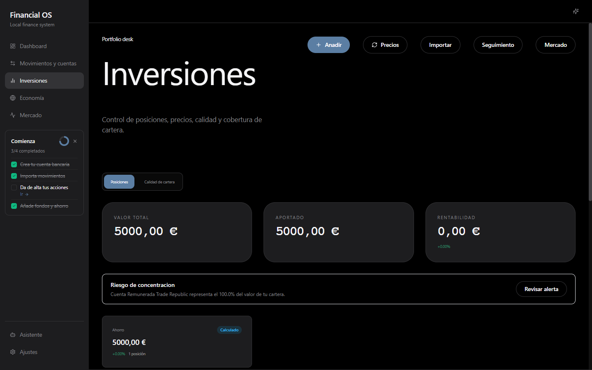
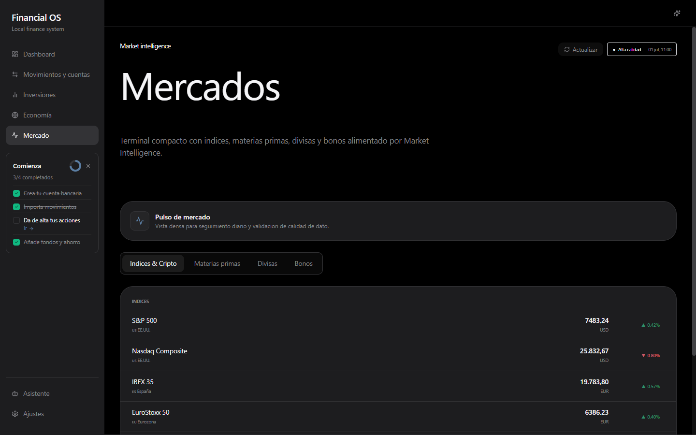
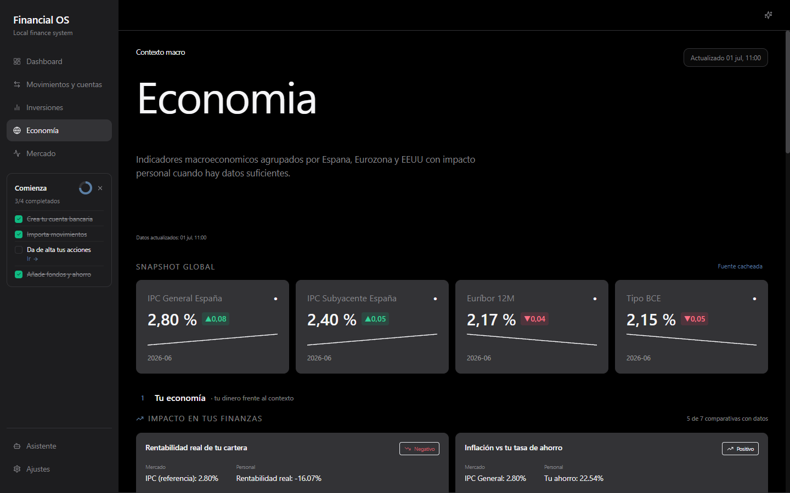

<div align="center">



# AI Financial OS

**Tu centro de control financiero personal — _local-first_, privado y con IA local opcional.**

Centraliza cuentas, gastos, patrimonio, inversiones, contexto macro y de mercado
en una app de escritorio para Windows. Sin nube, sin scraping bancario, sin ceder credenciales.


</div>

---

## ✨ Qué es

**AI Financial OS** no es una app de contabilidad, ni un chatbot financiero, ni un
agregador bancario. Es un **centro de control** que transforma datos financieros dispersos
en una visión clara y accionable, sobre un principio de producto simple:

> **Resumen → Explicación → Detalle → Acción.**

- 🔒 **Local-first absoluto** — todos tus datos personales viven en tu equipo (SQLite). Nada se sube a la nube.
- 📥 **Importación manual y consciente** — CSV/Excel (incluido formato Monefy). Sin automatización bancaria ni scraping.
- 🧮 **Cálculo determinista primero** — el backend calcula; la IA solo explica. La IA nunca inventa cifras ni consulta SQL directamente.
- 🤖 **IA 100% local y opcional** — Ollama o LM Studio. La app funciona por completo sin IA.
- 🎨 **Diseño _dark premium_** en español.

## 🖼️ Capturas

<div align="center">



<table>
<tr>
<td></td>
<td></td>
</tr>
<tr>
<td></td>
<td></td>
</tr>
</table>

<sub>Capturas con datos ficticios (mock) para mostrar el layout. Tus datos reales nunca salen del equipo.</sub>

</div>

## 🧩 Características

| Área | Qué ofrece |
|------|-----------|
| **Dashboard** | Patrimonio neto, ahorro neto, ritmo de gasto, últimos movimientos, objetivos e insights de un vistazo. |
| **Movimientos y cuentas** | Cuentas manuales y ledger financiero con búsqueda, filtros y nombres legibles (sin exponer IDs internos). |
| **Gastos** | Desglose mensual por categoría, tasa de ahorro, comparativa con el mes anterior y detección de categorías anómalas. |
| **Inversiones** | Posiciones, precios, rentabilidad, calidad y cobertura de cartera, riesgo de concentración, seguimiento y **conciliación**. |
| **Mercados** | Terminal compacto: índices, cripto, materias primas, divisas y bonos, con _quality score_ y última actualización por fuente. |
| **Economía** | Indicadores macro (IPC, Euríbor, Tipo BCE…) de España, Eurozona y EE. UU., con impacto en tus finanzas personales. |
| **Objetivos** | Metas financieras y simulaciones de escenarios de ahorro/inversión. |
| **Insights** | Recomendaciones deterministas basadas en tus propios datos. |
| **Planificación** | Presupuestos, transacciones recurrentes asistidas, facturas del hogar y previsión de _cashflow_. |
| **Importación** | Centro de importación CSV/Excel con _preview_, validación y confirmación antes de persistir. |
| **Documentos / RAG** | Indexa y consulta documentación financiera local (`txt`, `md`, `csv`, `json`) sin subirla a la nube. |
| **Asistente IA** | Copiloto contextual con IA local; usa _tools_ deterministas del backend, nunca SQL libre. |
| **Seguridad y backups** | Estado de _hardening_, backups locales de SQLite y comprobación de integridad. |

## 🏗️ Stack

| Capa | Tecnología |
|------|-----------|
| **Desktop** | Tauri 2 · React 18 · TypeScript · Tailwind CSS · Recharts · Framer Motion |
| **Backend** | Python 3.11+ · FastAPI · SQLAlchemy · Pydantic |
| **Datos** | SQLite (fuente transaccional + Market Intelligence en WAL) · DuckDB (analítica) |
| **IA local** | Ollama · LM Studio (abstracción multi-provider) |
| **Empaquetado** | Tauri (MSI / NSIS) + backend Python vía PyInstaller |

```txt
Tauri Desktop (React UI + API client)
        │  HTTP localhost
        ▼
FastAPI Backend  ──►  Financial Core · Import Center · Investments
                      Market Intelligence · Insights · Goals · Planning
                      AI Service (tools) · RAG · Security/Backups
        │
        ▼
Almacenamiento local:  SQLite (datos + mi_*)  ·  DuckDB (analítica)  ·  ficheros
```

Detalle en [docs/03_ARCHITECTURE.md](docs/03_ARCHITECTURE.md) y contrato de API en [docs/11_API_CONTRACT.md](docs/11_API_CONTRACT.md).

## ✅ Requisitos previos

- [Node.js 20+](https://nodejs.org/)
- [Rust stable](https://tauri.app/start/prerequisites/) — requerido por Tauri
- [Python 3.11+](https://www.python.org/)
- [uv](https://docs.astral.sh/uv/getting-started/installation/) — gestor de paquetes Python

## 🚀 Instalación y arranque (desarrollo)

```powershell
# 1. Setup (crea data/, backend/.env desde .env.example e instala dependencias)
.\scripts\setup.ps1

# 2. Arranca backend + app de escritorio con un único comando
npm run dev
```

> La primera compilación de Tauri puede tardar varios minutos mientras Rust descarga y compila dependencias.

Arranque por separado, si lo prefieres:

```powershell
# Backend
cd backend
uv run uvicorn app.main:app --reload

# Desktop (en otra terminal)
cd apps/desktop
npm run tauri dev
```

## ⚙️ Configuración

`scripts\setup.ps1` crea `backend\.env` a partir de [.env.example](.env.example).
**Todas las variables tienen valores por defecto**: la app funciona sin tocar nada.
Edita solo lo que necesites.

| Variable | Descripción | Requerida |
|---|---|---|
| `DATABASE_URL` | Ruta de la base de datos SQLite | No (default OK) |
| `AI_DEFAULT_PROVIDER` / `AI_DEFAULT_MODEL` | Proveedor (`ollama`/`lmstudio`) y modelo de IA local | Solo si usas IA |
| `OLLAMA_BASE_URL` / `LMSTUDIO_BASE_URL` | Endpoint de tu instancia local de IA | Solo si usas IA |
| `ALPHA_VANTAGE_API_KEY`, `FINNHUB_API_KEY`, `FMP_API_KEY`… | Amplían la cobertura de mercado (free tier) | Opcional |
| `FRED_API_KEY`, `EIA_API_KEY`, `AEMET_API_KEY` | Datos macroeconómicos (free tier) | Opcional |

> Sin claves de mercado, la app usa **Yahoo Finance + Stooq** para su catálogo base de activos.
> Nunca commitees tu `backend/.env` — está en `.gitignore`.

## 📦 Build del instalador

Requisitos adicionales: **Rust stable** y, en Windows, **WiX Toolset 3.x** para el `.msi`.

```powershell
cd apps/desktop
npm run tauri build
```

El instalador aparece en `apps/desktop/src-tauri/target/release/bundle/` (`msi/` y `nsis/`).
La build de release deshabilita las DevTools y aplica la CSP de producción de `tauri.conf.json`.

Al instalar, la app crea `backend/.env` automáticamente con valores por defecto (IA local, sin claves externas)
y guarda tus datos en `backend/data/` (`financial.db`, `analytics.duckdb`).

## 🔐 Seguridad y privacidad

- **Sin nube obligatoria, sin telemetría, sin credenciales bancarias.** Los datos personales no salen del equipo.
- **Datos de mercado/macro** se consultan online (no contienen datos personales), se **cachean** localmente y muestran su última actualización.
- **CSP de producción** restringe las conexiones del frontend a `localhost` (backend + IA local).
- **Token de API opcional** (`FINOS_API_TOKEN`) en el build empaquetado, con comparación de tiempo constante.
- Los secretos (`.env`) están **fuera de git**. Modelo de seguridad completo en [docs/10_SECURITY_MODEL.md](docs/10_SECURITY_MODEL.md).

## 🗂️ Estructura del proyecto

```txt
AI-Financial-OS/
├─ apps/desktop/          # App Tauri (React + TS)
│  ├─ src/features/       #   Pantallas: dashboard, investments, markets, economy…
│  └─ src-tauri/          #   Shell nativo, iconos, configuración de bundle
├─ backend/               # API FastAPI
│  └─ app/modules/        #   accounts, transactions, investments, market_intelligence,
│                         #   insights, goals, budgets, ai, rag, security…
├─ docs/                  # Arquitectura, modelo de datos, contrato API, roadmap
├─ scripts/               # setup / dev / backend / build (PowerShell)
└─ tools/ux-snapshot/     # Capturas automatizadas de la UI
```

## 🧪 Tests

```powershell
# Backend
cd backend
uv run pytest

# TypeScript (type-check)
cd apps/desktop
npx tsc --noEmit
```

## 📚 Documentación

La carpeta [`docs/`](docs/) contiene el brief de producto, la visión, la arquitectura,
el modelo de datos, el contrato de API, el roadmap y las notas por módulo.

## 📄 Licencia

[MIT](LICENSE) © 2026 Sergio Villarroel Fernandez
